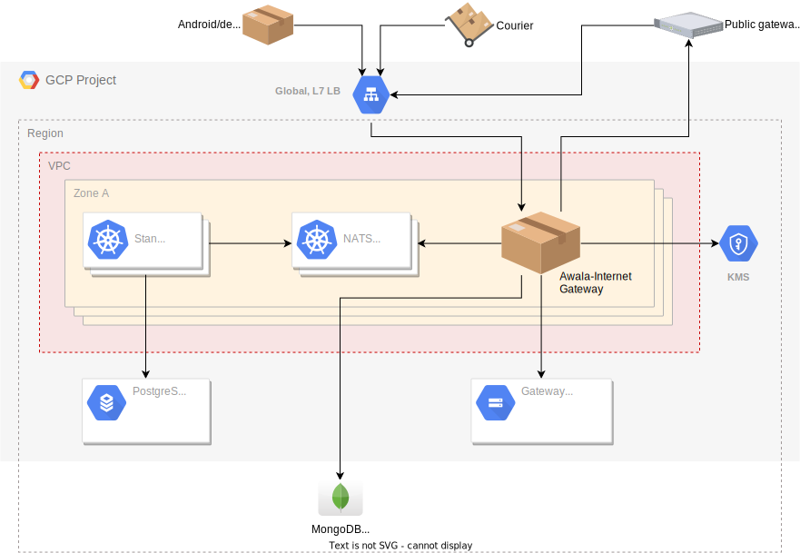

# Infrastructure for Relaycorp's Relaynet-Internet Gateways

This repository contains the code and configuration for the cloud and Kubernetes resources powering the [Relaynet-Internet Gateway](https://docs.relaycorp.tech/relaynet-internet-gateway/) instances operated by Relaycorp.

The cloud resources are defined in Terraform modules managed on Terraform Cloud. Shared resources can be found in [`tf-workspace/`](./tf-workspace), whilst environment-specific resources can be found under [`environments/`](./environments).

The Kubernetes resources are defined in Helm charts ([`charts/`](./charts)), which are automatically deployed by Google Cloud Build.

# Architecture

Gateways are entirely hosted on Google Cloud Platform (GCP). Each instance is deployed to a highly-available, independent environment under a shared GCP project. The following diagram offers a simplified view of the key cloud and Kubernetes resources in each environment:

To learn more about the architecture of the Relaynet-Internet Gateway, please [refer to its documentation](https://docs.relaycorp.tech/relaynet-internet-gateway/architecture).

# Why the infrastructure code is public

For a few reasons:

1. To protect Relaycorp SREs from targeted cyberattacks to compromise the infrastructure. Our goal to bring connectivity to regions disconnected from the Internet is at odds with the interests of certain nation-state actors, so any successful attempt to coerce us or trick us into changing the infrastructure will be public.
1. To be transparent with our users, customers and partners.
1. To get feedback from external SREs and SecDevOps engineers.

Things aren't quite bullet-proof yet. [Read issue #8](https://github.com/relaycorp/cloud-gateway/issues/8) to learn more about the endgame.

Since Relaynet employs end-to-end encryption, the confidentiality of the communication won't be affected by a successful attack to this infrastructure. Please refer to [RS-019](https://specs.relaynet.network/RS-019) to learn more about the general security threats of Relaynet.

# Contributions are welcomed

We're particularly keen to get feedback and PRs to improve the security of the infrastructure. If you've never contributed to a Relaycorp project before, please take a minute to [read our guidelines](https://github.com/relaycorp/.github/blob/master/CONTRIBUTING.md) first.

Please note that whilst this repository is open source, this isn't a white-labelled project: The code here is meant to be 100% specific to Relaycorp and we'll often make backwardly-incompatible changes. If you want to use it to host your own instance of the gateway, you should fork this repository and tailor it to your needs; refer to the licence to learn more about what you can do with it.
